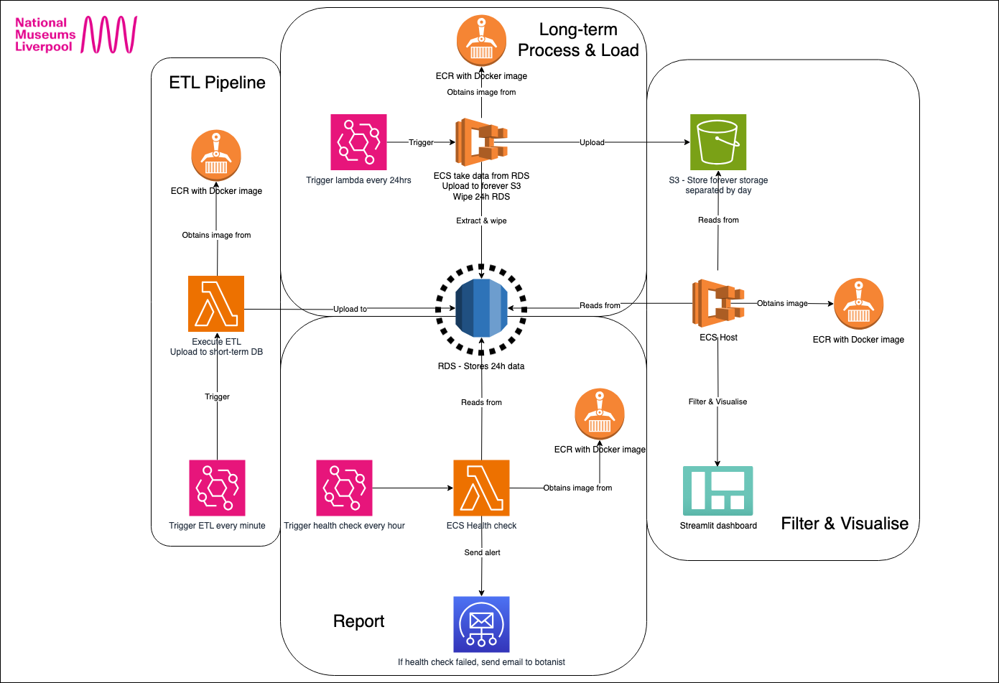
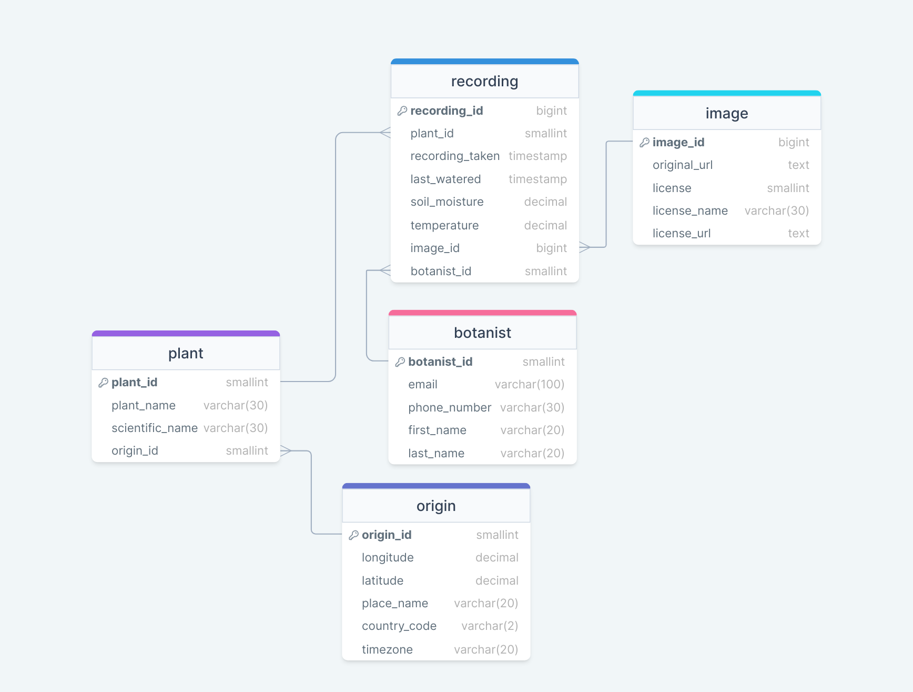
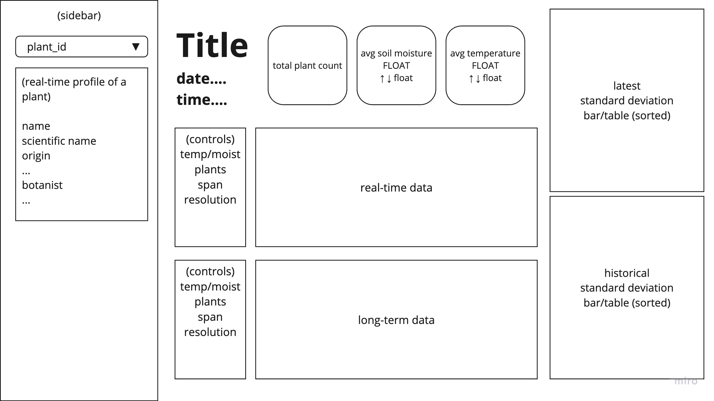

# Liverpool Natural History Museum - Plant Sensors Data Pipeline

## Description 

A full data pipeline, hosted in the cloud (using a variety of software listed below) that covers the following:
- An extract, transform and load (ETL) pipeline that processes and uploads plant data to a relational database service (RDS) every minute.
- A short term RDS that is hosted on AWS and stores the plant-related data for the past 24 hours.
- A 'health check' pipeline that runs every hour, detecting and notifying botanists, through email, of any anomalous recordings related to their associated plant.
- A long term storage pipeline for all data >= 24 hours in the RDS, uploading a shortened summary version of recording data for each plant to an S3 bucket on the cloud.
- A dashboard hosted on the cloud which pulls in data from the short and long term data storages, providing metrics and visualisations for the data.

### Architecture diagram:

## Folder details

### Pipeline (ETL)

1. Connect to `LMNH Plant API` consisting of all relevant plant data.
2. Retrieve plant data and clean it of extreme values or errors.
3. Transform plant data into a data frame conforming to `RDS` entity-relationship diagram.
4. Upload plant data to short-term storage solution - `RDS`.

### Entity-relationship diagram:

### Health check (Report)

1. Connect to `RDS` storing 24hr plant recording data.
2. Retrieve cleaned and formatted recording data for each plant.
3. Using previous hourly readings, calculate average and detect anomalous readings.
4. Send hourly report of anomalous readings to relevant botanist.

### Long-term (Process & Load)

1. Connect to `RDS` storing 24hr plant recording data every day.
2. Retrieve cleaned and formatted recording data for each plant.
3. Create summarised (to hour) of recordings for each plant.
4. Detect and generate anomalies recordings for each plant
5. Upload summarised and anaomalies `csv` to an `S3` bucket on `AWS`.

### Dashboard (Filter & Visualise)

1. Connect to both `RDS` and `S3` to retrieve short and long term plant recording data.
2. Query RDS for relevant data to visualise and calculate metrics.
3. Collect requested `csv` files from `S3` historical data.
4. Filter and visualise recordings for each plant.
5. Calculate relevant metrics for stakeholders/botanists.

### Dashboard Wireframe:

## Installation/Setup Instructions

*Python3* dependant scripts

1. If running locally on a Mac-machine rather than terraforming, please go to the `bash_commands` folder and run `bash download_pymssql.sh` in your terminal.
2. Create and activate a new virtual environment.
3. Run 'pip3 install -r requirements.txt' to install dependencies.
4. Create a '.env' file to store the necessary keys to connect to AWS RDS and S3 Bucket.
    For the S3 Bucket:
    - AWS_KEY
    - AWS_SKEY

    For the AWS RDS:
    - 'DATABASE_NAME'
    - 'DATABASE_USER'
    - 'DATABASE_PASSWORD'
    - 'DATABASE_IP'
    - 'DATABASE_PORT'

5. Create a 'terraform.tfvars' file - check terraform readme for more information.